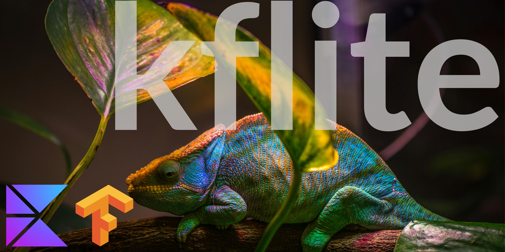

[](https://opensource.org/licenses/0BSD)
[](https://kotlinlang.org/)
[](https://gradle.org/)


<p align="center"> kflite is a fresh and improved version of <a href="https://github.com/icerockdev/moko-tensorflow">moko-tensorflow</a></p>

## Overview

kflite runs TensorFlow Lite (tflite) models directly from shared Kotlin code.
It abstracts platform differences, and manages model loading, tensor creation, and inference through
a unified API.

Key features:

- Works with Compose Multiplatform `composeResources`
- Supports model normalization (`YOLO`, `COCO`, `PascalVOC`, `TF formats`)
- Enable/Disable
  quantization <a href="https://huggingface.co/docs/optimum/en/concept_guides/quantization">What's
  quantization?</a>
- Image input models (Support for NLP models are on the
  way [FollowUp](https://github.com/shadmanadman/kflite/issues/8))
- Select Delegation (GPU and NNAPI on Android, METAL and CoreML on iOS)
- Whether to allow inference with float16 precision for FP32 models. `allowFp16PrecisionForFp32`
- The preference for inference speed and accuracy. `SUSTAINED_SPEED` `FAST_SINGLE_ANSWER`

## Getting Started

For a fastest setup and a working example,
see [KfliteSample](https://github.com/shadmanadman/kflite-sample). It demonstrates a full pipeline.

## Installation

### Add dependencies

Include the dependency in your shared `commonMain.dependencies` </br>

``` gradle
implementation("io.github.shadmanadman:kflite:1.1.35")
```

#### Configure for iOS

Since KMP doesn’t automatically include CocoaPods dependencies in the consumer's `iosApp`, you need to manually add TensorFlow
Lite for iOS. </br>
Create a `Podfile` inside your `iosApp` with following pods:

```
target 'iosApp' do
  use_frameworks!
  platform :ios, '16.0'
  pod 'TensorFlowLiteObjC'
  pod 'TensorFlowLiteObjC/Metal'
  pod 'TensorFlowLiteObjC/CoreML'
end
```

## Run a Model

### Step 1 - Place model

Put your `.tflite` model file in `composeResources/files`.</br>
You can view an example model placement on[Kflite Sample](https://github.com/shadmanadman/kflite-sample/tree/main/composeApp/src/commonMain/composeResources/files).

kflite uses `Compose Resources` to manage assets in a platform-independent way.Your model becomes
available to all targets by converting it into a byte array.

### Step 2 - init the model

kflite loads and prepares your model for inference with optional performance parameters. </br>
Call `Kflite.init()` and load your model as a byte array. This creates an interpreter instance in
memory.

``` kotlin
Kflite.init(
    model = Res.readBytes("files/efficientdet-lite2.tflite"),
    options = InterpreterOptions(
        numThreads: Int = 4,
        delegateType: DelegateType = DelegateType.CPU,
        inferencePreferenceType: TFLiteInferencePreference = TFLiteInferencePreference.PLATFORM_DEFAULT,
        allowQuantizedModels: Boolean = true,
        allowFp16PrecisionForFp32: Boolean = false,
    )
)
```

- `numThreads`: number of threads allocate to CPU. Defualt is 4
- `delegateType`: selects hardware acceleration backend.(GPU and NNAPI on Android, METAL and CoreML
  on iOS)
- `allowFp16PrecisionForFp32`: speeds up inference if supported by hardware
- `inferencePreferenceType` The preference for inference speed and accuracy.(Platform default on
  Android is FAST_SINGLE_ANSWER and on iOS WaitTypePassive)
- `allowQuantizedModels` Whether to allow inference with quantized models.

### Step 3 - Prepare the input data

Kflite works with direct `ByteBuffer` as input, so you can feed preprocessed inputs or tensors
directly.</br>
[Netron](https://netron.app/) is a great tool for visualizing your model. You can see your model
input/output details.</br>
You can see input tensor shape of your model by calling `getInputTensor`, Checkout your model
metadata or use [Netron](https://netron.app/) to check input dimensions and each shape represents.

- To see the number of input tensor that your model has, you can call [`getInputTensorCount`](https://github.com/shadmanadman/kflite-sample/blob/8cb1175576a2b3dcf7bd30d400528c5a38e92714/composeApp/src/commonMain/kotlin/org/kmp/playground/kflite/sample/RunModelWithInputImageExample.kt#L30).

Following example shows how to prepare input data for a model that takes an image as input and the
input have a 4D matrix.

Our model has 4 shape. The batch size,image width,
image height and the pixel size.
- If you know the amount of each shape, just hard code them in a const, since each shape is constant.

``` kotlin
val pixcelSize = Kflite.getInputTensor(0).shape[0] = 1
val inputImageWidth = Kflite.getInputTensor(0).shape[1] = 448
val inputImageHeight = Kflite.getInputTensor(0).shape[2] = 448
val floatTypeSize = Kflite.getInputTensor(0).shape[3] = 3
```

Calculate the input size.This will be used to allocate the size of byte buffer.

``` kotlin
val modelInputSize =
    floatTypeSize * inputImageWidth * inputImageHeight * pixcelSize
```

Create a ByteBuffer from your input data.
This is for image inputs. (Text inputs will be supported soon.)
Following example scales an image to match model input size and converts it into a normalized float
array.</br>

- When the `normalize` is true, the code performs Image Normalization and Data Type Conversion on the
  pixel data before feeding it into the byte buffer.
  This changes the data type of the input in the buffer from an 8-bit integer to 32-bit floating
  point.True this only for models that supports input data in a range of [0.0,1.0].

``` kotlin
val inputImage =  imageResource(Res.drawable.example_model_input)
    .toScaledByteBuffer(
        inputWidth = inputImageWidth,
        inputHeight = inputImageHeight,
        inputAllocateSize = modelInputSize,
        normalize: Boolean = false
    )   
```

### Step 4 - Prepare the output data

Create a container that matches the model’s output tensor shape. This gives you a correctly sized
structure to hold the results.
You can see output tensor shape of your model by calling `getOutputTensor`, Checkout your model
metadata or use [Netron](https://netron.app/)</br>

- To see the number of input tensor that your model has, you can call [`getOutputTensorCount`](https://github.com/shadmanadman/kflite-sample/blob/8cb1175576a2b3dcf7bd30d400528c5a38e92714/composeApp/src/commonMain/kotlin/org/kmp/playground/kflite/sample/RunModelWithInputImageExample.kt#L31).

Following example shows how to prepare output data for a object detection model that outputs a 3D matrix. 
Our example model has 3 shape. The batch size (number of input), number of results and the bounding box location.</br>
- If you know the amount of each shape, just hard code them in a const, since each shape is constant.

``` kotlin
val batchSize = Kflite.getOutputTensor(0).shape[0] = 1
val numberOfResults = Kflite.getOutputTensor(0).shape[1] = 25
val detailsPerResult = Kflite.getOutputTensor(0).shape[2] = 4
```

We then create a matrix to hold the model output.

``` kotlin
val modelOutputContainer = Array(batchSize) {
    Array(numberOfResults) {
        FloatArray(detailsPerResult)
    }
}
```


### Step 5 - Running the model:

Call `Kflite.run()` and pass the input and output containers:

[`Kflite.run()`](https://github.com/shadmanadman/kflite-sample/blob/8cb1175576a2b3dcf7bd30d400528c5a38e92714/composeApp/src/commonMain/kotlin/org/kmp/playground/kflite/sample/RunModelWithInputImageExample.kt#L51) performs inference on the model. You feed it the inputs and provide a container for
outputs, and it returns predictions, detections, or classifications depending on your model type.

- `inputs`: List of input tensors.
- `outputs`: A map linking output tensor indices to the containers you created earlier.

If your model supports multiple input/output, add them to the list.

``` kotlin
Kflite.run(
    inputs = listOf(inputImage), // The input made in step 3
    outputs = mapOf(Pair(0,modelOutputContainer)) // the output prepared in step 4
)
```

### Step 6: Close the model:

Once inference is complete, you call `close()` to free up resources and safely release the
interpreter to avoid memory leaks.

``` kotlin
Kflite.close()
```

Once closed, all underlying TFLite interpreters are released.

## Normalizing Model Output
Most detection models output is in model-scaled coordinates.</br>
When you resize your image to match the model input, you need to normalize the output data into the original size.</br>
This normalization is not necessary unless you want to match the original to the model output. For example putting a bounding box on the original image or</br>
modify the original data based on the model output.

You can use this normalizing extensions to rescale object detection bounding boxes into the original image.
The `normalizedBox` will be a data class contain the new ordinations.

``` kotlin
val normalizedBox = Normalization(
    originalImageHeight = 1080f, //Original input height
    originalImageWidth = 2010f, // Original input width
    modelImagWidth = 448f, //Model input width
    modelImageHeight = 448f //Model input height
).YOLO(
    center_x = 20f, //CenterX of Model Output From The Model
    center_y = 20f,//CenterY of Model Output From The Model
    width = 100f,  //Width of Model Output From The Model
    height = 120f //Height of Model Output From The Model
)
```

**Other supported normalizing:**

- `Normalization.pascalVOC(x_min, y_min, x_max, y_max)`
- `Normalization.coco(x, y, width, height)`
- `Normalization.yolo(cx, cy, width, height)`
- `Normalization.tfObjectDetection(top, left, bottom, right)`
- `Normalization.tfRecordVariant(x_min, y_min, x_max, y_max)`

## What's next

- Support for NLP models
- Migrate to [litert](https://github.com/google-ai-edge/LiteRT)
- Support Kotlin/Native
- Live detection with Camera feed

## Licence

```
Copyright (c) 2025 kflite

Permission to use, copy, modify, and/or distribute this software for any purpose
with or without fee is hereby granted.

THE SOFTWARE IS PROVIDED "AS IS" AND THE AUTHOR DISCLAIMS ALL WARRANTIES
WITH REGARD TO THIS SOFTWARE INCLUDING ALL IMPLIED WARRANTIES OF
MERCHANTABILITY AND FITNESS. IN NO EVENT SHALL THE AUTHOR BE LIABLE FOR
ANY SPECIAL, DIRECT, INDIRECT, OR CONSEQUENTIAL DAMAGES OR ANY DAMAGES
WHATSOEVER RESULTING FROM LOSS OF USE, DATA OR PROFITS, WHETHER IN AN
ACTION OF CONTRACT, NEGLIGENCE OR OTHER TORTIOUS ACTION, ARISING OUT OF
OR IN CONNECTION WITH THE USE OR PERFORMANCE OF THIS SOFTWARE.
```


